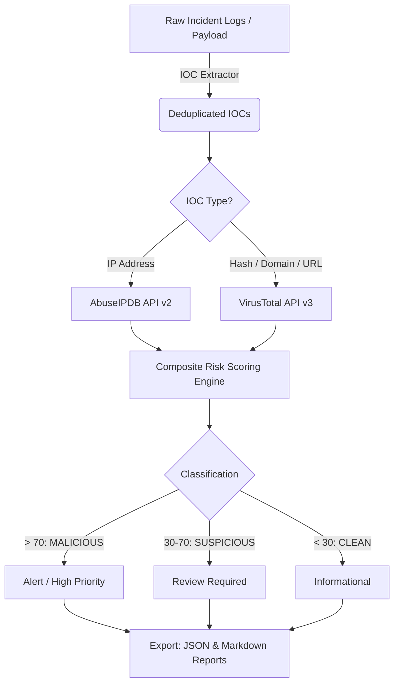

# 🛡️ Automated Threat Intel & IOC Scanner Pipeline


A production-grade, asynchronous threat intelligence and Indicators of Compromise (IOC) scanning pipeline built for Security Operations Center (SOC) analysts and Incident Responders. Automatically extracts, enriches, risk-scores, and reports threats across multiple intelligence feeds.

[Author Portfolio](https://ajit028.github.io) • [LinkedIn](https://linkedin.com/in/ajit028)

---

## 🚀 Feature Highlights

- **🔍 Multi-Type IOC Extraction**: Instantly parses logs, emails, and text payloads for IPv4, IPv6, MD5, SHA-1, SHA-256 hashes, domains, URLs, and email addresses.
- **🌐 Enterprise Threat Feeds**: Seamlessly integrates with **VirusTotal (v3)** and **AbuseIPDB (v2)** for real-time reputation lookups.
- **⚡ Concurrent Processing**: Leverages multi-threaded execution (`ThreadPoolExecutor`) for high-speed batch enrichment while respecting rate limits.
- **📊 Advanced Risk Scoring Engine**: Calculates composite risk scores combining detection ratios, confidence ratings, and behavioral flags.
- **🏷️ Actionable Classifications**: Categorizes threats instantly into `MALICIOUS` (>70), `SUSPICIOUS` (30–70), and `CLEAN` (<30).
- **🎨 Professional Reporting**: Generates colorized terminal outputs, structured JSON reports, and comprehensive Markdown audit logs.
- **🔧 Zero External Dependencies for Core**: Uses only Python standard library for CLI coloring and regex (requests optional for API calls).

---

## 🏗️ Architecture & Pipeline Flow



---

## 📦 Installation

1. **Clone the repository**:
   ```bash
   git clone https://github.com/ajit028/automated-threat-intel-scanner.git
   cd automated-threat-intel-scanner
   ```

2. **Install dependencies**:
   ```bash
   pip install -r requirements.txt
   ```

3. **Configure API Keys**:
   Set your API keys as environment variables:
   ```bash
   export VT_API_KEY="your_virustotal_api_key_here"
   export ABUSEIPDB_API_KEY="your_abuseipdb_api_key_here"
   ```
   Or configure them via the CLI:
   ```bash
   python scanner.py config --vt-key "YOUR_KEY" --abuseipdb-key "YOUR_KEY"
   ```

---

## 🛠️ Usage & CLI Examples

### 1. Scan an Incident Log File
```bash
python scanner.py scan --input sample-data/sample_incident.log --output report.md --format markdown
```

### 2. Scan a Single IOC Directly
```bash
python scanner.py scan --ioc "185.220.101.5"
```

### 3. Generate Structured JSON Export
```bash
python scanner.py scan --input sample-data/sample_incident.log --output report.json --format json
```

### 4. Interactive Configuration Management
```bash
python scanner.py config --show
```

---

## 📊 Sample Output Preview

```text
[+] Initializing Threat Intelligence Scanner v1.0.0...
[+] Loaded 18 unique IOCs from sample-data/sample_incident.log
[+] Querying Threat Feeds (VirusTotal, AbuseIPDB) with 5 threads...

[MALICIOUS] 185.220.101.5 (IPv4) | Risk Score: 95/100 | VT: 14/85 | AbuseIPDB: 100% confidence
[MALICIOUS] 44d88612fea8a8f36de82e1278abb02f (MD5) | Risk Score: 88/100 | VT: 58/72
[SUSPICIOUS] 45.33.32.156 (IPv4) | Risk Score: 45/100 | AbuseIPDB: 35% confidence
[CLEAN] 8.8.8.8 (IPv4) | Risk Score: 0/100 | VT: 0/88 | AbuseIPDB: 0% confidence

[+] Scan complete. Summary: Total: 18 | Malicious: 4 | Suspicious: 2 | Clean: 12
[+] Report generated successfully: report.md
```

---

## 🛡️ MITRE ATT&CK® Relevance

This pipeline assists security analysts in mapping observed IOCs to the MITRE ATT&CK framework:
- **T1588.005 (Obtain Capabilities: Known Malware)**: Hash lookups against VirusTotal.
- **T1071 (Application Layer Protocol)**: Domain and URL reputation analysis.
- **T1590 (Gather Victim Network Information)**: IP address abuse reporting via AbuseIPDB.

---

## 👤 Author

**Ajit Nayak**
- Portfolio: [ajit028.github.io](https://ajit028.github.io)
- LinkedIn: [linkedin.com/in/ajit028](https://linkedin.com/in/ajit028)
- GitHub: [@ajit028](https://github.com/ajit028)

---

## 📄 License

Distributed under the MIT License. See `LICENSE` for more information.